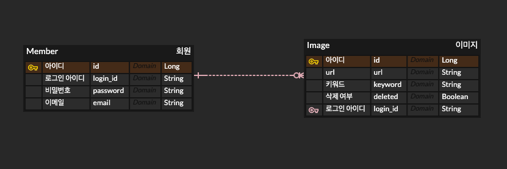

### DB Schema

---

- 이미지 테이블은 login_id를 외래키로 갖습니다.
- 논리적으로 삭제하기 위해서 삭제 여부를 따로 저장했습니다.

### AWS

---

> AWS를 사용해서 *DB 연동* 과 *서버 배포* 를 했습니다.
>
- RDS와 MySQL 연동
- EC2 인스턴스 생성 후 서버 배포
- 배포가 과제는 아니었지만, 가장 우려했던 부분이었기에 시도해보았습니다.

**배포 주소**

[프론트] https://make-my-image-app.vercel.app/

[서버] [https://makeimage-jk.store](https://makeimage-jk.store/)

[스웨거] https://makeimage-jk.store/swagger-ui/index.html

### 궁금한 사항 및 구현하지 못한 부분

---

- 요구사항에 맞춰서 매번 다른 DTO를 생성하는지 궁금합니다.
  - 예를 들어, 이미지 전체 조회에서는 { url, 생성시간 } 을 이미지 단건 조회에서는 { 키워드, url, 생성시간 } 조회가 가능한 것이 요구사항인데 그렇다면 응답 객체를 2개를 따로 만들어야 하는지 궁금합니다.
  - 이번 구현에서는 요구하지 않은 정보도 함께 반환했습니다.
- 보안과 관련된 JWT 부분은 이해하지 못하여 구현하지 못했습니다.
  - 추후에 보완할 예정입니다.